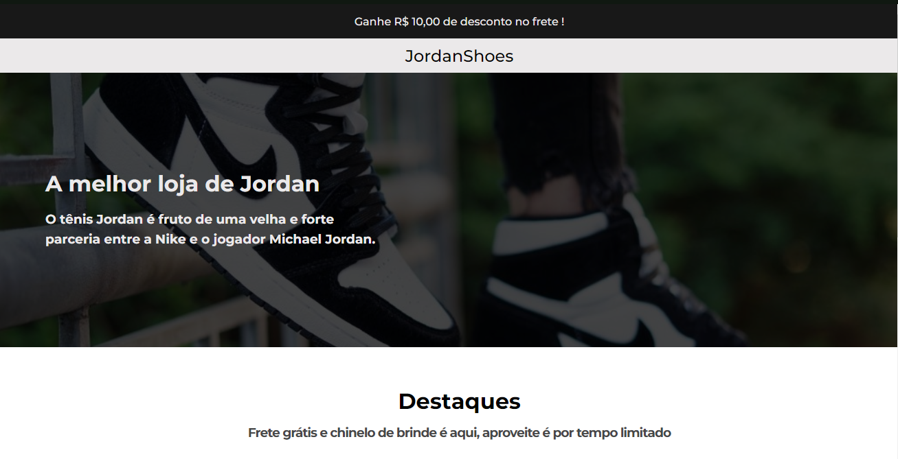
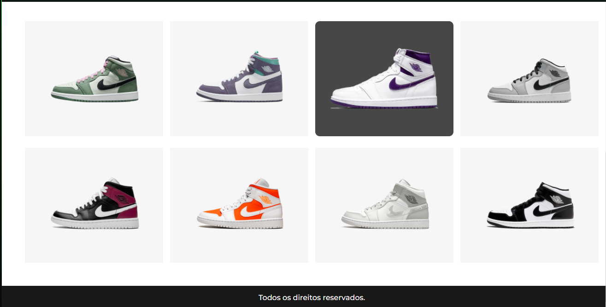

<h1 align="center">Front Page Responsiva</h1>

    <h2>Desafio proposto pelo instrutor @iuricode, lá na comunidade de Devs no discord, chamada Codelândia, que consiste em criar a Front Page de um site, de forma responsiva, com:  
    </h2>  

    <h1 align="center">Site com a tela interia</h1>
  
   

  
